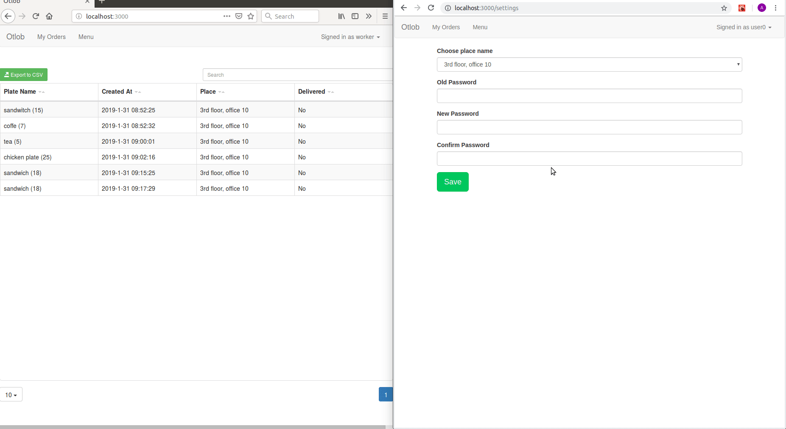

# Food Ordering System
A meteor reactive data system for food ordering that was designed for internal use cases in offices and factories. 

## Technologies used
* [Meteor](http://meteor.com).
* [React](https://github.com/facebook/react).
* [Minimongo](https://github.com/mWater/minimongo)
* [React data tracker](https://github.com/meteor/react-packages/tree/devel/packages/react-meteor-data).
* [React bootstrap table](https://github.com/AllenFang/react-bootstrap-table)

## How to use

* Install Meteor from [here](https://www.meteor.com/install).
* `git clone https://github.com/Arsanuos/food-ordering-system.git`
* `cd food-ordering-system`
* `meteor`

## Features
* Responsive design

* Immediate change on insert

* Immediate change on delete

* Adapting new data (office changed)

* Adapting new data (new item in menu)

* Multi-column search

* Input validation

* Role managment (only worker can modify menu normal user and admin can't)

## Licence
All code is licensed under the MIT License.
